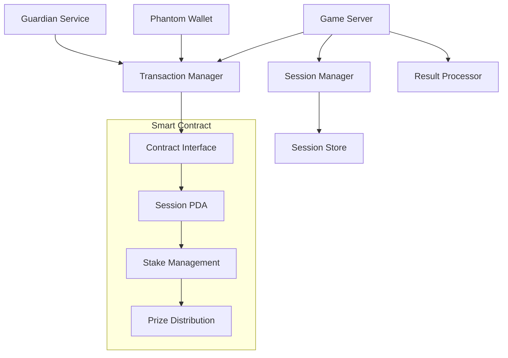
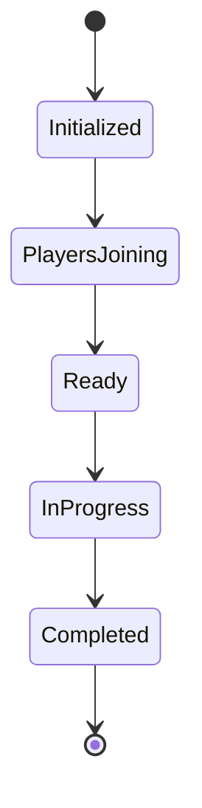
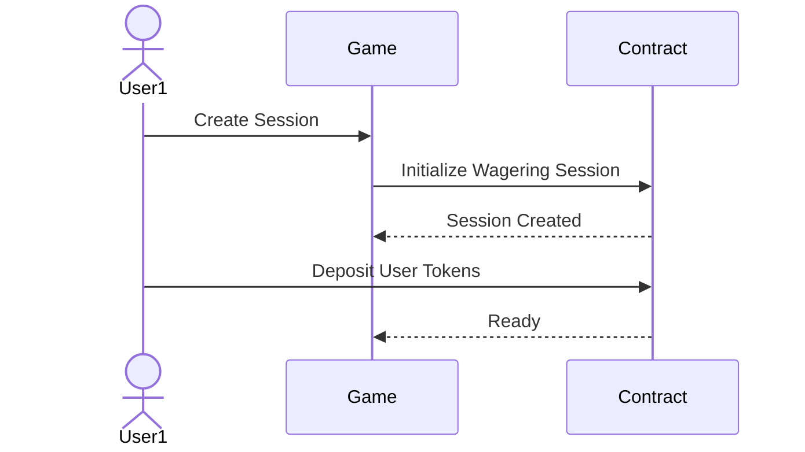
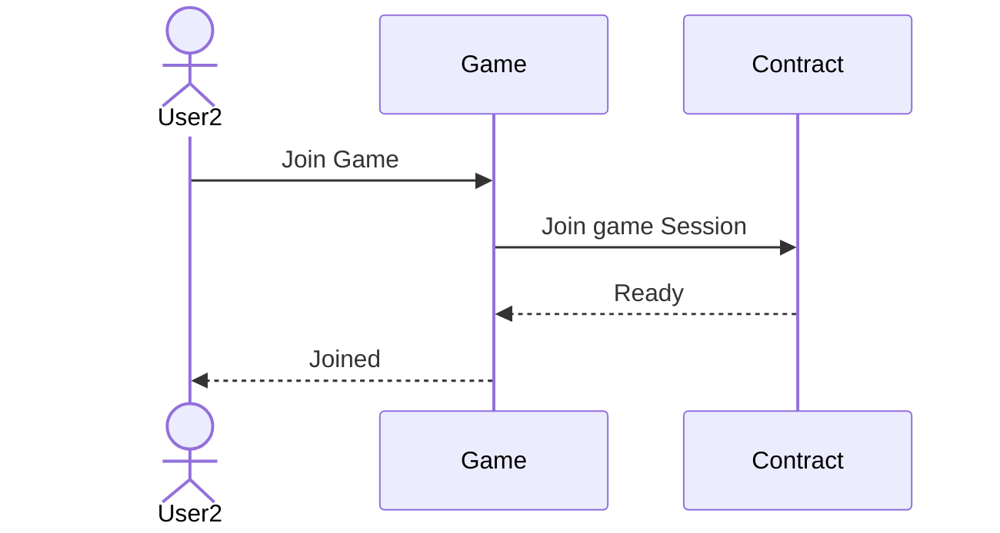
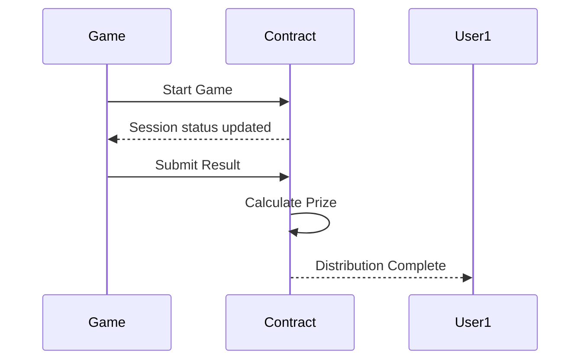
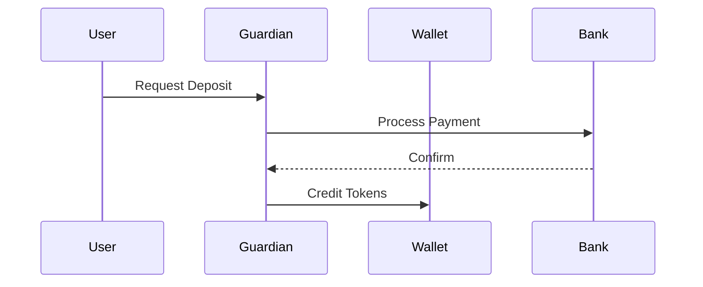

# Web3 Gaming Platform Integration Documentation

## Table of Contents

1. System Overview
2. Architecture Components
3. Integration Flows
4. Security Considerations
5. Game Integration Guide

## 1. System Overview

A web3 gaming platform enabling wagered gameplay through Phantom wallet, with on/off ramp capabilities and future social login integration.

## 2. Architecture Components

### System Components



### Component Descriptions

**Game Server**

- Manages game sessions and player interactions
- Handles wager verification
- Processes game results
- Controls prize distribution

**Session Manager**

- Creates and maintains game sessions
- Tracks player participation
- Manages session states
- Validates session requirements

**Transaction Manager**

- Handles wallet interactions
- Manages stake deposits
- Processes withdrawals
- Interfaces with Guardian for on/off ramp

**Smart Contract**

- Session PDA creation and management
- Stake locking mechanism
- Prize pool management
- Automated distribution

**Integration Services**

- Phantom Wallet: User wallet connection and transactions
- Guardian: Fiat on/off ramp processing
- Session Store: Game state persistence

### State Management



## 3. Integration Flows

### Session Creation Flow



The session creation flow handles the initial setup of a wagering game:

1. User initiates game session creation through game interface
2. Game server requests contract to create a new wagering session with specified parameters
3. Contract creates PDA for session management and returns confirmation
4. User deposits required tokens to participate
5. Contract verifies deposit and updates game status to ready

Key aspects:

- Session PDA manages all game participants and stakes
- Initial deposit locks player's stake
- Session state validates readiness for gameplay

### Users Joining Flow



The joining flow manages additional players entering an existing session:

1. User2 requests to join existing game session
2. Game verifies session availability and requirements
3. Contract validates player eligibility and stake requirements
4. After validation, player officially joins session
5. Game notifies player of successful join

Key aspects:

- Validates session capacity
- Verifies stake requirements
- Updates session state with new player

### Game Execution Flow



Handles the actual gameplay and prize distribution:

1. Game initiates gameplay once conditions met
2. Contract updates session to "in progress"
3. Game submits final results directly to contract
4. Contract calculates prize amounts based on result and stakes
5. Prizes automatically distributed to winners

Key aspects:

- Direct result submission without oracle
- Automated prize calculation
- Immediate distribution to winners

### Payment Flow



Manages fiat to crypto conversions via Guardian:

1. User initiates deposit request
2. Guardian processes payment through traditional banking
3. Bank confirms transaction completion
4. Guardian credits equivalent tokens to user's wallet

Key aspects:

- Secure payment processing
- Automated token conversion
- Real-time wallet updates

## 5. Game Integration Guide

### Prerequisites

- Solana web3.js
- Phantom wallet adapter
- Guardian SDK

### Integration Steps

1. **Initialize Connection**

   - Connect to Solana network
   - Setup wallet listeners
   - Initialize contract connection

2. **Room Management**

   - Create/join game rooms
   - Handle player states
   - Manage wager amounts

3. **Game Flow**

   - Start game verification
   - Result submission
   - Prize distribution handling

4. **Error Handling**
   - Connection failures
   - Transaction failures
   - State inconsistencies

# Utility File to interact with the chain

```
import { Program, AnchorProvider, Idl, setProvider, BN } from "@coral-xyz/anchor";
import { PublicKey, Connection } from "@solana/web3.js";
import { WagerProgram } from "../types/wager_program";
import idl from "../idl/wager_program.json";
import * as anchor from "@coral-xyz/anchor";

interface IProgramUtils {
  createGameSession(sessionId: string, betAmount: number, gameMode: any): Promise<string>;
  joinUser(sessionId: string, team: number): Promise<string>;
  distributeWinnings(sessionId: string, winningTeam: number): Promise<string>;
  getGameSession(sessionId: string): Promise<GameSessionState>;
  distributePrize(sessionId: string, winningTeam: number, winnerPubkey: string): Promise<string>;
}

interface GameSessionState {
  betAmount: anchor.BN;
  creator: anchor.web3.PublicKey;
  teamA: anchor.web3.PublicKey[];
  teamB: anchor.web3.PublicKey[];
  status: 'waitingForPlayers' | 'inProgress' | 'completed';
}

// Update the type definition for the status parameter
type GameSessionStatus = {
  waitingForPlayers?: {};
  inProgress?: {};
  completed?: {};
};

function mapGameStatus(status: GameSessionStatus): 'waitingForPlayers' | 'inProgress' | 'completed' {
  // Check which enum variant is defined
  if (Object.prototype.hasOwnProperty.call(status, 'waitingForPlayers')) {
    return 'waitingForPlayers';
  }
  if (Object.prototype.hasOwnProperty.call(status, 'inProgress')) {
    return 'inProgress';
  }
  if (Object.prototype.hasOwnProperty.call(status, 'completed')) {
    return 'completed';
  }

  // Fallback (should never happen with valid data)
  return 'waitingForPlayers';
}

export class ProgramUtils implements IProgramUtils {
  private program: Program<WagerProgram>;
  private provider: AnchorProvider;
  private readonly PROGRAM_ID = new PublicKey("8PRQvPo16yG8EP5fESDEuJunZBLJ3UFBGvN6CKLZGBUQ");

  constructor(connection: Connection, wallet: any) {
    this.provider = new AnchorProvider(connection, wallet, AnchorProvider.defaultOptions());
    setProvider(this.provider);
    const programId = new PublicKey(idl.address);
    console.log("Program ID from IDL:", programId.toString());

    this.program = new Program(idl as any, this.provider);
  }

  async createGameSession(sessionId: string, betAmount: number, gameMode: any): Promise<string> {
    try {
      const tx = await this.program.methods
        .createGameSession(sessionId, new BN(betAmount), gameMode)
        .accounts({
          gameServer: this.provider.wallet.publicKey,
        })
        .rpc();
      return tx;
    } catch (error) {
      console.error("Error creating game session:", error);
      throw error;
    }
  }

  async joinUser(sessionId: string, team: number): Promise<string> {
    try {
      const tx = await this.program.methods
        .joinUser(sessionId, team)
        .accounts({
          user: this.provider.wallet.publicKey,
          gameServer: this.provider.wallet.publicKey,
        })
        .rpc();
      return tx;
    } catch (error) {
      console.error("Error joining game:", error);
      throw error;
    }
  }

  async getGameSession(sessionId: string): Promise<GameSessionState> {
    try {
      // Generate the game session PDA
      const [gameSessionPDA] = anchor.web3.PublicKey.findProgramAddressSync(
        [Buffer.from("game_session"), Buffer.from(sessionId)],
        this.program.programId
      );

      console.log("Game session PDA:", gameSessionPDA.toString());


      // Fetch the account data using the PDA
      const gameSession = await this.program.account.gameSession.fetch(
        gameSessionPDA
      );

      // Log the raw data structure
      console.log("Raw game session data:", gameSession);

      // Return the formatted game session state
      return {
        betAmount: new anchor.BN(gameSession.sessionBet),
        creator: gameSession.authority,
        teamA: gameSession.teamA.players.filter((player: anchor.web3.PublicKey | null) => player !== null),
        teamB: gameSession.teamB.players.filter((player: anchor.web3.PublicKey | null) => player !== null),
        status: mapGameStatus(gameSession.status),
      };
    } catch (error) {
      console.error('Error fetching game session:', error);
      throw new Error(`Failed to fetch game session: ${error}`);
    }
  }

  async distributePrize(sessionId: string, winningTeam: number, winnerPubkey: string): Promise<string> {
    try {
      // Convert the winner pubkey string to a PublicKey object
      const winnerPublicKey = new PublicKey(winnerPubkey);

      // Call the distribute prize instruction
      const tx = await this.program.methods
        .distributeWinnings(sessionId, winningTeam)
        .accounts({
          gameServer: this.provider.wallet.publicKey,
          winner1: winnerPublicKey, // Use the provided winner public key
        })
        .rpc();

      return tx;
    } catch (error) {
      console.error("Error distributing prize:", error);
      throw error;
    }
  }
}
```
