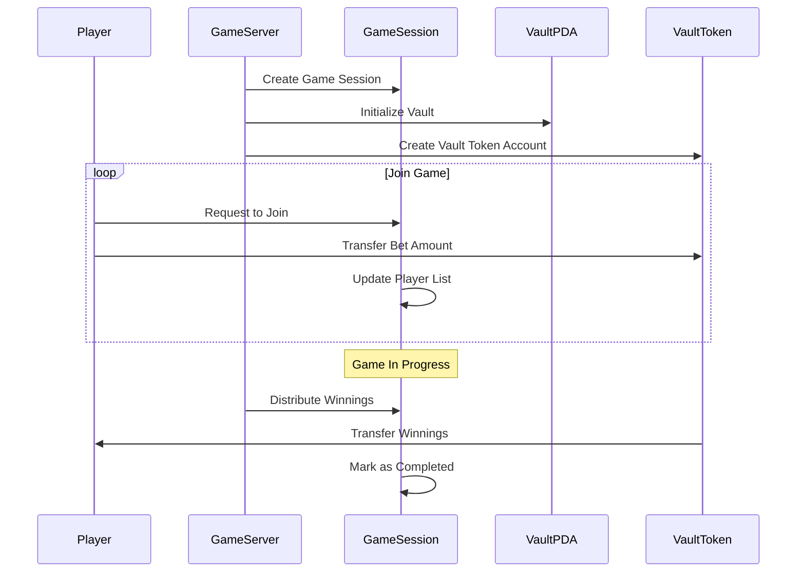
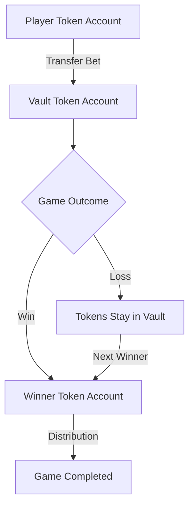

# SPL Token Implementation in Game System

## Overview

SPL (Solana Program Library) tokens are Solana's standard for creating and managing tokens on the Solana blockchain. In our game system, we use SPL tokens to handle betting and rewards in a secure and decentralized manner. The SPL tokens in future will be the $SKILL tokens which players use exclusively to place wager and take winnings.

## Key Components

### 1. Token Accounts

- **User Token Account**: Each player must have an SPL token account that holds their tokens
- **Vault Token Account**: A PDA (Program Derived Address) that temporarily holds all the wagered tokens during a game session
- **TOKEN_ID**: The mint address of the specific SPL token used in the game

### 2. PDAs (Program Derived Addresses)

- **Game Session PDA**: Stores game state and metadata
- **Vault PDA**: Holds authority over the vault token account

## Game Flow



## Token Management



## Implementation Details

### Creating a Game Session

```rust
// Initialize the game session and vault
pub struct CreateGameSession<'info> {
    pub game_server: Signer<'info>,
    pub game_session: Account<'info, GameSession>,
    pub vault: AccountInfo<'info>,
    pub vault_token_account: Account<'info, TokenAccount>,
    // ... other fields
}
```

### Joining a Game

1. Player initiates join request
2. System verifies player has sufficient tokens
3. Tokens are transferred to vault token account
4. Player is added to team roster

### Token Transfer Security

- All token transfers require proper signatures
- Vault PDA ensures only authorized withdrawals
- Associated Token Program handles account creation
- Token account ownership is verified before transfers

### Distributing Winnings

```rust
// Transfer tokens from vault to winner
anchor_spl::token::transfer(
    CpiContext::new_with_signer(
        ctx.accounts.token_program.to_account_info(),
        Transfer {
            from: vault_token_account,
            to: winner_token_account,
            authority: vault_pda,
        },
        &[&[seed, bump]]
    ),
    winning_amount
)?;
```

## Security Considerations

1. **Account Validation**

   - All token accounts are verified for correct ownership
   - Mint addresses are validated
   - PDAs are checked for correct derivation

2. **State Management**

   - Game status transitions are strictly controlled
   - Player counts are validated
   - Team assignments are verified

3. **Token Safety**
   - Vault ensures atomic operations
   - No tokens can be withdrawn without proper game completion
   - Double-spending is prevented by design

## Error Handling

The system includes comprehensive error handling through `WagerError` enum:

- InvalidGameState
- InvalidTeamSelection
- UnauthorizedDistribution
- InvalidWinningTeam
- InvalidTokenMint
- InvalidWinner
